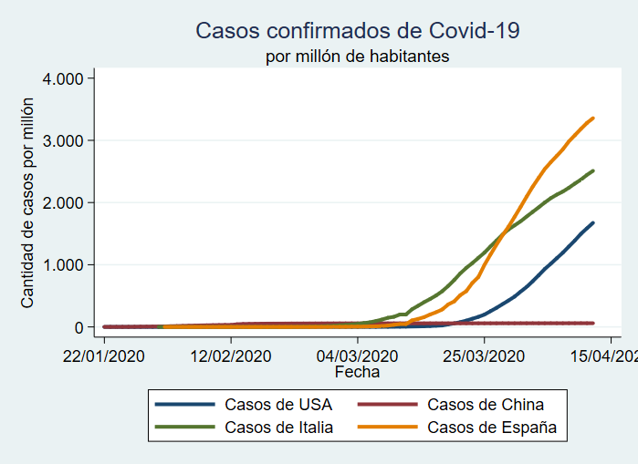
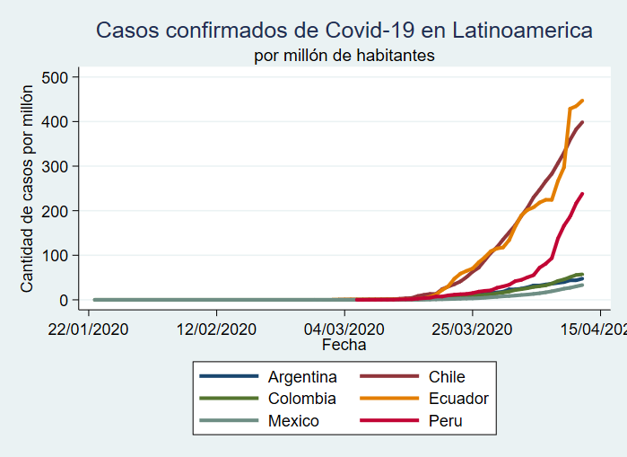
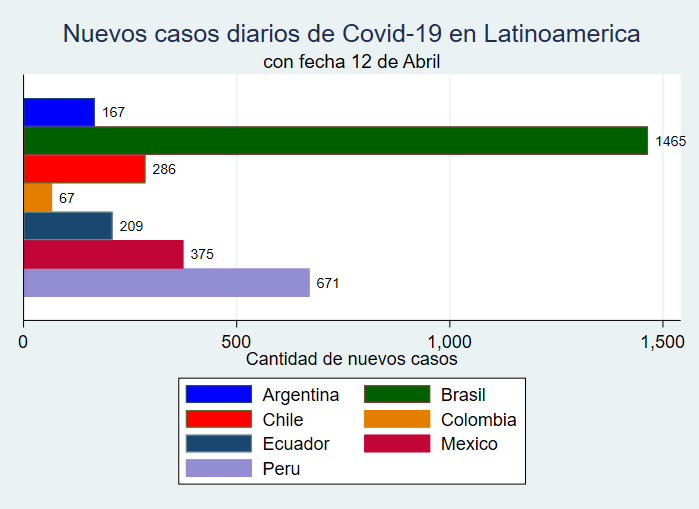

## Limpieza y Análisis de datos Covid-19 con STATA
### Fuente Universidad de Johns Hopkins

La Universidad de Johns Hopkins está recolectando diariamente información a nivel mundial de los casos de coronavirus.
Los archivos, están recopilados en archivos .csv independientes, por lo mismo, a la hora de trabajarlos es necesario crear un panel de datos que permita seguir los paises en el tiempo.

Por lo mismo, STATA Corp ha estado creando una serie de guías de referencia para unir estos archivos, limpiar el código y así comenzar a investigar nuestros paises de interés.

Los arhivos que se encuentran en esta carpeta, permitirán hacer gráficas por millón de habitantes, nuevos casos diarios, comparativas entre países, etc.

**Do Files**:

- **covid19_long_code_educational.do**: Contiene una guía paso a paso para la limpieza del código. Toma 7 a 8 minutos correrlo completo. Se recomienda revisarlo por tramos.
- **covid19_short_code_graph.do**: Es un resumen de código anterior, más una selección de países latinoamericanos para graficar.

**Base de datos (.dta)**:
La base de datos es extraída directamente desde el GitHub de la Universidad de Johns Hopkins, por lo tanto **no hay un dta inicial**.

**Sitios importantes:**
- Link de GitHub de la Universidad de Johns Hopkins:
[https://github.com/CSSEGISandData/COVID-19](https://github.com/CSSEGISandData/COVID-19)

- STATA Blog:
[https://blog.stata.com/](https://blog.stata.com/)
